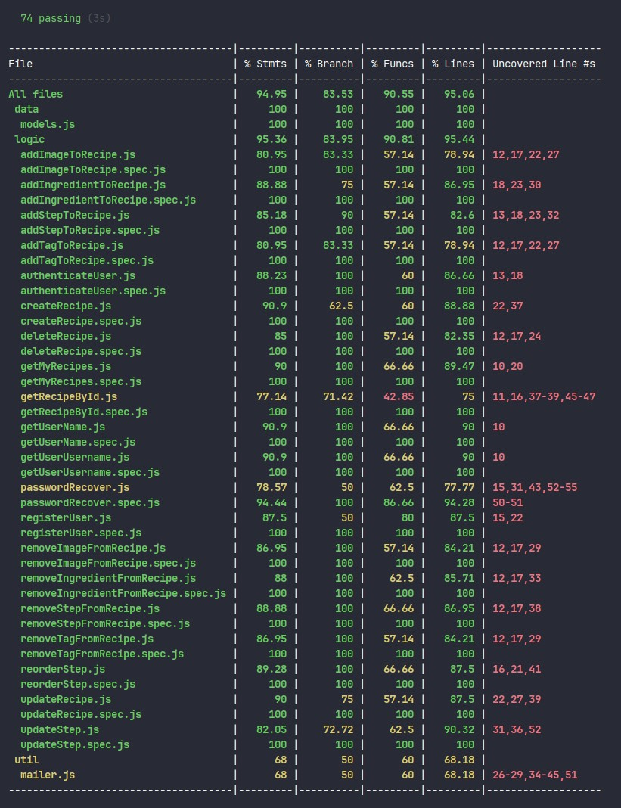

<br>

# Vegazetas

## Introduction

**Vegazetas** is a web application (SPA) that allows users to **create, view, edit, and delete recipes**. It features a very colorful, eye-catching, and simple interface, providing a comfortable and easy user experience—both for creating recipes and for viewing them while cooking.

The app includes several sections and functionalities. For access, it has **sign-up**, **log-in**, and **password recovery** via an email link. Once logged in, users can navigate through the **menu** and use the **create recipe** button.

Currently, it offers the **My Recipes** section, which displays a list of the user's recipes as thumbnails and allows direct navigation to the **recipe view** when one is selected. From the recipe view, users can delete the recipe or navigate to the edit section.

In the **edit** section, users can modify recipe fields, as well as add or remove images, tags, ingredients, and steps. Steps can be edited and reordered. All recipe fields will be described in more detail in the [Data Model](#data-model) section.

In **future versions**, new features will be implemented, such as:
- Recipe filtering by ingredients, tags, and titles
- Viewing recipes from other users and a like button to save them to a new "Favorites" section
- Sharing recipes via link
- Recipe list section
- Links to external recipes
- Draft/private recipe creation, to publish them later
- User profile modification and account deletion
- Automatic generation of an editable shopping list based on recipe ingredients
- Menu planning calendar
- Cooking mode: button to prevent screen from turning off on mobile or tablet while cooking
- Adjust servings (x2, x3...) to user preference
- Adjustable font size in recipes
- Fully responsive app (already has basic responsiveness)
- And much more!

<br>

## Functional

### Use Cases

User

- Sign-up
- Log-in
- Password recovery via email
- Log-out
- Recipe creation
- Recipe editing
    - Editing and reordering steps
- Recipe deletion
- Viewing selected recipe
- Viewing "my recipes"

### UXUI Design

[Figma](https://www.figma.com/proto/wJ7OQyaNcJneXTPpf4jx6X/Vegazetas?node-id=149-214&t=m7ZNRd48c95egXOo-1&scaling=scale-down&content-scaling=fixed&page-id=149%3A212&starting-point-node-id=149%3A214)

## Technical

### Structure

- App
- API
- DB

### Packages

- app
- api
- com
- doc (documentation)

### Technologies

- HTML/CSS/JS
- React
- Node/Express

### Data Model

**User**
- id *(ObjectId)*
- name *(string)*
- email *(string)*
- username *(string)*
- password *(string) - bcrypt*

**Ingredient**
- id *(ObjectId)*
- name *(string)*
- quantity *(num)*
- unit *(string)*
- annotation *(string)*
- main *(boolean (default: true))*

**Step**
- id *(ObjectId)*
- text *(string)*
- note *(string)*
- image *(string)*
- order *(number)*

**Recipe**
- id *(ObjectId)*
- author *(ObjectId - **User**)*
- [images] *(strings array)*
- title *(string)*
- date *(Date (default: Date.now))*
- description *(string)*
- time *(number)*
- difficulty *(string)*
- [tags] *(strings array)*
- [ingredients] *(**ingredients** array)*
- [steps] *(**steps** array)*

### UI Components

```sh
App
 |- Landing
 |- Register
 |- Login
 |- PasswordReset
 |- Home
    |- Menu
        |- Header (Menu)
    |- MyRecipes
        |- Header (common)
        |- [RecipeThumbnail]
    |- Recipe:id
        |- Header (common)
    |- SaveRecipe:id (create/update recipe)
        |- Header (common)
    # |- Favorites
    # |- Lists
    # |- Menus
    # |- Shopping list
    # |- Discover
    # |- Links
    # |- Profile (edit, delete...)
 ```

### Coverage

