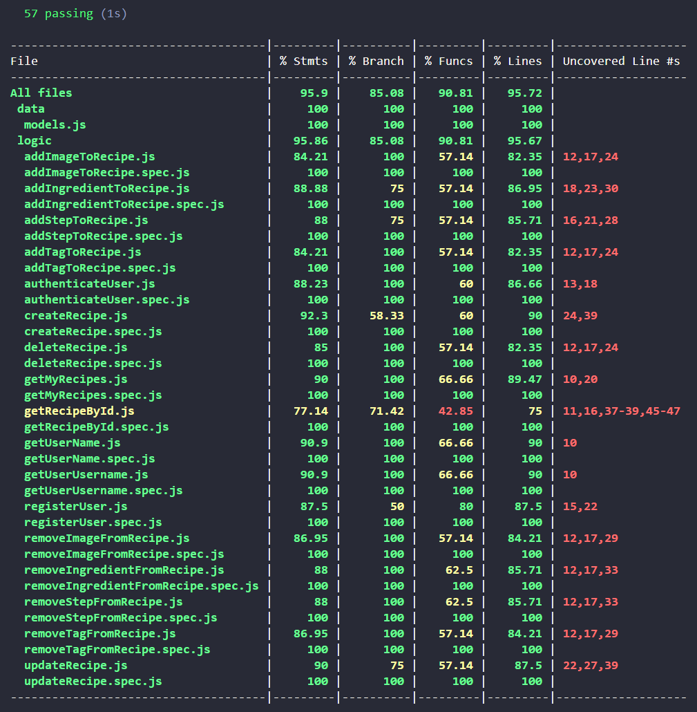

<br>

# Vegazetas

## Intro

## Intro

**Vegazetas** is a web application that allows you to **create, view, edit, and delete recipes**. It features a **colorful**, **eye-catching**, and **simple** interface, offering a **comfortable** and **intuitive** user experience—both for creating recipes and for viewing them while cooking in the kitchen.

The app includes several **sections** and **features**. In terms of access, there is a section for **sign-up** and **login**. Once logged in, users will find a **navigation menu** to move between the different sections and a button to **create a recipe**.

It includes the **My Recipes** section, a list of recipe thumbnails created by the user with direct navigation to the **recipe view** when selected. Inside a recipe, users can delete it or navigate to the **edit recipe** section.

In the **edit** section, users can modify any recipe field, as well as remove or add new **images**, **tags**, **ingredients**, and **steps**. The recipe fields will be described in more detail in the [**Data Model**](#data-model) section.

In **future versions**, new features will be implemented, such as:

- Filtering recipes by *ingredients*, *tags*, and *titles*
- Viewing recipes from other users and a **like** button to save them in a new **My Favorites** section
- Sharing recipes via *link*
- A section for *recipe lists*
- External *links to recipes* outside of Vegazetas
- Creating recipes in *draft/private* mode to publish them later
- Modifying the *user profile* and deleting the account
- Automatically generating an *editable shopping list* based on recipe ingredients
- *Menu planning calendar*
- *Cooking mode*: a button to prevent the mobile or tablet screen from turning off while cooking
- Changing the *font size* in recipe view
- *Responsive app design*
- *And much more!*

<br>


## Functional

### Use Cases

User

- Sign up
- Log in
- Log out
- Create recipe
- Edit recipe
- View selected recipe
- View "My Recipes"


### UXUI Design

[Figma](https://www.figma.com/proto/wJ7OQyaNcJneXTPpf4jx6X/Vegazetas?node-id=149-214&t=m7ZNRd48c95egXOo-1&scaling=scale-down&content-scaling=fixed&page-id=149%3A212&starting-point-node-id=149%3A214)


## Technical

### Blocks

- App
- API
- DB

### Packages

- app
- api
- com
- doc (documentation)

### Techs

- HTML/CSS/JS
- React
- Node/Express

### Data Model

**User**
- id *(ObjectId)*
- name *(string)*
- email *(string)*
- username *(string)*
- password *(string) - bcrypt*

**Ingredient**
- id *(ObjectId)*
- name *(string)*
- quantity *(num)*
- unit *(string)*
- annotation *(string)*
- main *(boolean (default: true))*

**Step**
- id *(ObjectId)*
- text *(string)*
- note *(string)*
- image *(string)* 

**Recipe**
- id *(ObjectId)*
- author *(ObjectId - **User**)*
- [images] *(strings array)*
- title *(string)*
- date *(Date (default: Date.now))*
- description *(string)*
- time *(number)*
- difficulty *(string)*
- [tags] *(strings array)*
- [ingredients] *(**ingredients** array)*
- [steps] *(**steps** array)*

### UI Components

```sh
App
 |- Landing
 |- Register
 |- Login
 |- Home
    |- Menu
        |- Header (Menu)
    |- MyRecipes
        |- Header (common)
        |- [RecipeThumbnail]
    |- Recipe:id
        |- Header (common)
    |- SaveRecipe:id (create/update recipe)
        |- Header (common)
    # |- Favorites
    # |- Lists
    # |- Menus
    # |- Shopping list
    # |- Discover
    # |- Links
    # |- Profile (edit, delete...)
 ```

### Coverage




## Tasks

[GitHub](https://github.com/b00tc4mp/isdi-parttime-202410/issues/45)